# 1. Introduction

Image classification is tricky and it becomes even trickier when I don't know exactly where in an image my objects of interest will appear or  what size they'll be or even how many of them I might find. 

In this lesion I will focus on the task of detecting vehicles in images taken from a camera mounted on the front of a car but the same principles apply to pedestrian detection, or traffic sign detection, or identifying any object I might be looking for in an image. 

Object detection and tracking is a central theme in computer vision and in this lesson I will be using what you might call traditional computer vision techniques to tackle this problem. 

I will first explore what kind of visual features I can extract from images in order to reliably classify vehicles. Next, I will look into searching an image for detections and then I will track those detections from frame to frame in a video stream. In the end of this lesson, I am going to implement a pipeline to detect and track vehicles in a video stream.

# 2. Manual Vehicle Detection

 
 

 
Assume, I will have an algorithm that's outputting bounding box positions and I'll want an easy way to plot them up over my images (like above). So, now is a good time to get familiar with the cv2.rectangle() function that makes it easy to draw boxes of different size, shape and color.

    cv2.rectangle(image_to_draw_on, (x1, y1), (x2, y2), color, thick)
 
In this call to cv2.rectangle() my image_to_draw_on should be the copy of your image, then (x1, y1) and (x2, y2) are the x and y coordinates of any two opposing corners of the bounding box I want to draw. color is a 3-tuple, for example, (0, 0, 255) for blue, and thick is an optional integer parameter to define the box thickness.

If you want to investigate this function more closely, take a look at the bounding boxes exercise [code](https://github.com/A2Amir/Object-Detection/blob/master/code/BoundingBoxesExercise.ipynb)

# 3. Features

Color, Apparent size, shape , position within image  are useful characteristics for identifying cars in an  image. All of these potential characteristics are features that I can use.  Features describe the characteristics of an object and with images, it really all comes down to intensity and gradients of intensity, and how these features capture the color and shape of an object.

Different features (like intensity and gradients of intensity) capture  the characteristic(s) about an object in an image. For example by **raw pixel intensity** (I mean essentially taking the image itself as features) give us color and shape information or **Histogram of pixel intensity** (With a histogram, I've discarded spatial information) give us only color information or **Gradients of pixel intensity** give us information about shaps only.

What features are more important may depend upon the appearance of  the objects in question. In most applications, I'll end up using a combination of features that give me the best results. 

 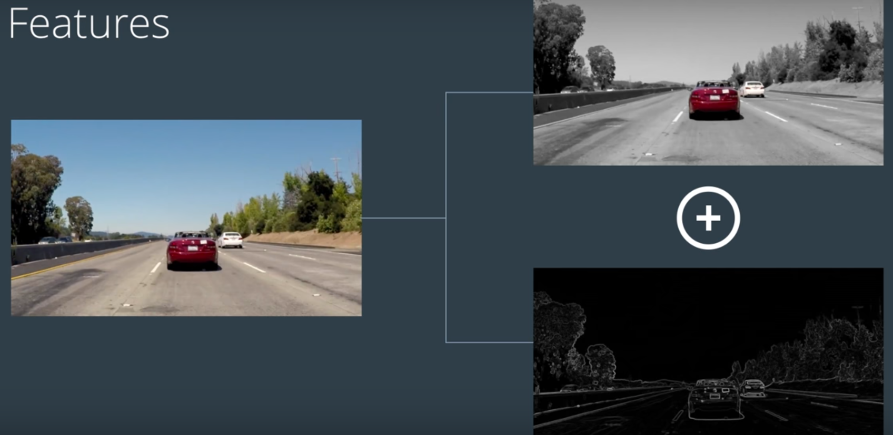
 

 
 # 4. Color Features and Template matching
 
 The simplest feature I can get from images consists of raw color values. For instance, below is an image of a car. Let's say I want to find out whether some region (yellow box) of a new test image contains a car or not.  Well, using my known car image as is (red car), I can simply find the image difference between the car image and the test region (yellow box), and see the difference is small. 
This basically means subtracting the corresponding color values, aggregating the differences and comparing it with the threshold. 

 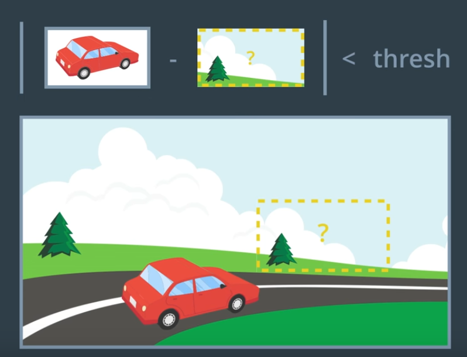
 

 
Note: alternatively, I could compute the correlation between the car image and test region and check if that is high.

This general approach is known as template matching. My known image is the template and I try to match it with regions of the test image. Template matching does work in limited circumstances but isn't very helpful for my case. 

To figure out when template matching works and when it doesn't, I am going to play around with the OpenCV cv2.matchTemplate() function! In [the bounding boxes exercise](https://github.com/A2Amir/Object-Detection/blob/master/code/BoundingBoxesExercise.ipynb), I found six cars in the image above. This time, I am going to play the opposite game. Assuming I know these six cars are what I am looking for, I can use them as templates and search the image for matches.

 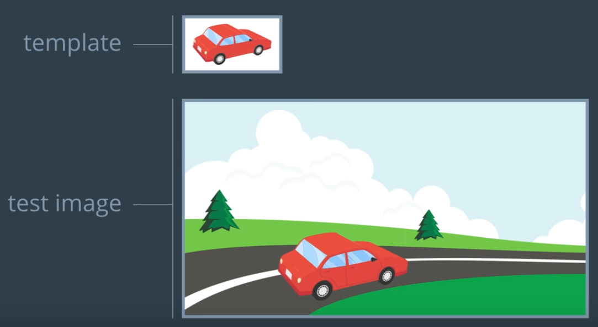
 

 
As seen in [the Template Matching code](https://github.com/A2Amir/Object-Detection/blob/master/code/TemplateMatchingExercise.ipynb) with template matching we can only find very close matches, and changes in size or orientation of a car make it impossible to match with a template.

# 5. Color Histogram Features
Template matching is useful for detecting things that do not vary in their appearance much. For instance, icons or emojis on the screen. But for most real world objects that appear in different forms, orientation, sizes, this technique doesn't work quite well because it depends on raw color values laid out in a specific order.

To solve this problem I need to find some transformations that are robust to changes in appearance. a transform is to compute the histogram of color values in an image and compare the histogram of a known object with regions of a test

 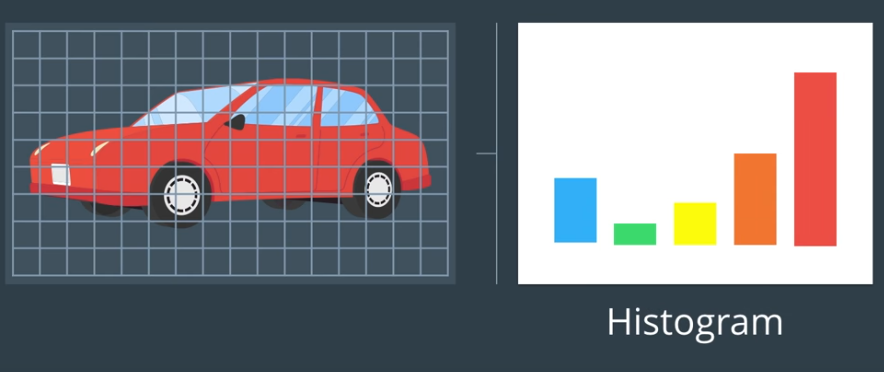
 

 
#### Color Histograms Exercise 
In this exercise I'll use one template used from the last exercise as an example and look at histograms of pixel intensity (color histograms) as features by using

     np.histogram()

Check this [code](https://github.com/A2Amir/Object-Detection/blob/master/code/ColorHistogramsExercise%20.ipynb) to get more information.

#### Histogram Comparison

Let's look at the color histogram features for two totally different images. The first image is of a red car and the second a blue car. The red car's color histograms are displayed on the first row and the blue car's are displayed on the second row below. Here I am just looking at 8 bins per RGB channel.

I could differentiate the two images based on the differences in histograms alone. As expected the image of the red car has a greater intensity of total bin values in the R Histogram 1 (Red Channel) compared to the blue car's R Histogram 2. In contrast the blue car has a greater intensity of total bin values in B Histogram 2 (Blue Channel) than the red car's B Histogram 1 features. Differentiating images by the intensity and range of color they contain can be helpful for looking at car vs non-car images.

 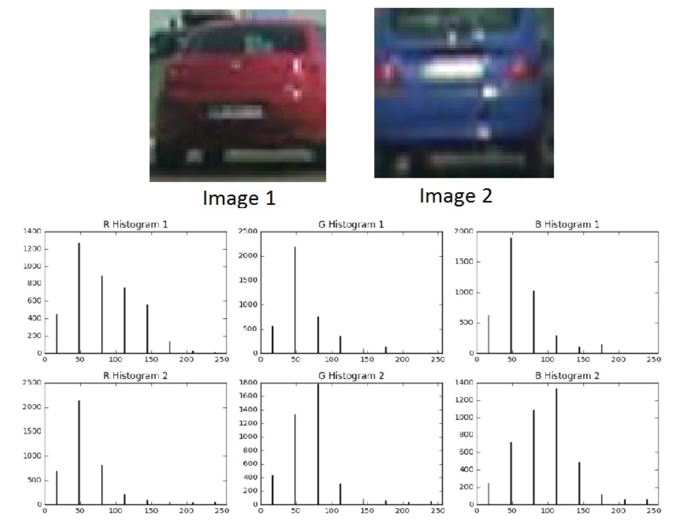
 

# 6. Color Spaces

Whether I use raw colors directly or build a histogram of those values, I still haven't solved the problem of representing objects of the same class that can be of different colors. Let's take a look at the image below to see how its color values are distributed in the RGB color space.

 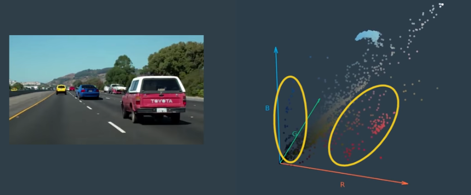
 

 
In the above example, the red and blue cars' pixels are clustered into two separate groups. Although I could come up with a scheme to identify these groups using RGB values but it can get complicated very quickly as I try to accommodate different colors. 

In the [lane finding lesson](https://github.com/A2Amir/Advanced-Lane-Line-Finding), I explored other color spaces like HLS and LUV to see where alternated representations of color space could make the object I am looking for stand out against the background. Instead of the raw red, green, blue values I get from a camera I look at saturation values (HSV color space) which seem the car pixels for the image above cluster  well on the saturation value plane.

 
 

 
But this(well clustering) may not be true for other images. In the next exercise I look at how the pixel values are distributed in a different color space and then I want to check if car pixels stand out from non-car pixels.

#### Explore Color Spaces Ecercise

Here is [a code](https://github.com/A2Amir/Object-Detection/blob/master/code/ExploreColorSpacesExercise.ipynb) snippet that can be used to generate 3D plots of the distribution of color values in an image by plotting each pixel in some color space.

As seen in the exercise by trying different color spaces such as LUV or HLS I can find a way to consistently separate vehicle images from non-vehicles but It doesn't have to be perfect, but it will help when combined with other kinds of features fed into a classifier.

# 7. Spatial Binning of Color
raw pixel values are still quite useful to include in my feature vector in searching for cars. While it could be cumbersome to include three color channels of a full resolution image, I can perform spatial binning on an image and still retain enough information to help in finding vehicles.

As seen in the example below, even going all the way down to 32 x 32 pixel resolution, the car itself is still clearly identifiable by eye, and this means that the relevant features are still preserved at this resolution.

 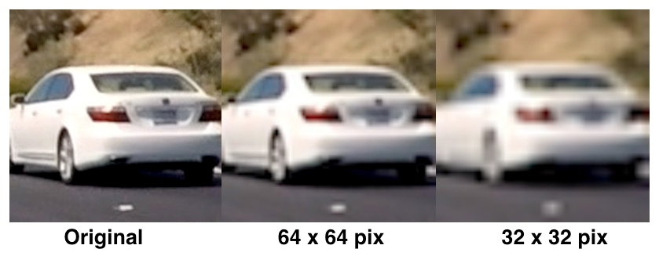
 

 
A convenient function for scaling down the resolution of an image is OpenCV's cv2.resize(). I can use it to scale a color image or a single color channel like this:
~~~python
import cv2
import matplotlib.image as mpimg

image = mpimg.imread('test_img.jpg')
small_img = cv2.resize(image, (32, 32))
print(small_img.shape)
(32, 32, 3)
~~~
then I can  convert the small image to a one dimensional feature vector, I could simply say something like:
~~~python
feature_vec = small_img.ravel()
print(feature_vec.shape)
(3072,)
~~~

#### Spatial Binning Exercise
the goal of [this exercise](https://github.com/A2Amir/Object-Detection/blob/master/code/SpatialBinningExercise.ipynb) is to write a function that takes an image, a color space conversion, and the resolution I would like to convert it to, and returns a feature vector.

# 8. Gradient Features

Transforming color values give me only one aspect of an object's appearance. When I have a class of objects that can vary in color (see below), structural ques like gradients or edges might give me a more robust presentation. 

 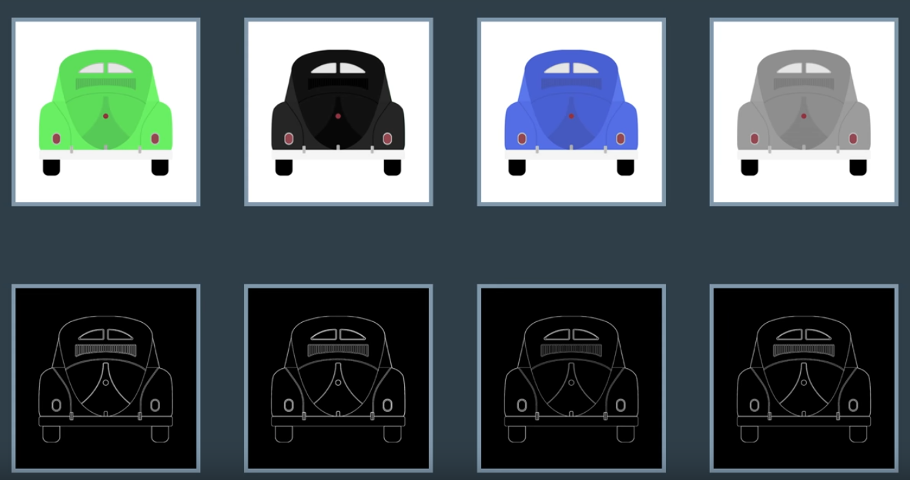
 

 
 One problem with using gradient values directly is that it makes the signature too sensitive.  In fact, the presence of gradients in specific directions around the center may actually capture some more notion of shape. Let's take a look at some simple shapes to better understand this idea.
Below is  a gradient image(in specific directions around the center) of a triangle If I chop up the gradients into different grid cells and treat the cells as a flat (1D array) I obtain a signature for the triangle. Similarly to a circle.

 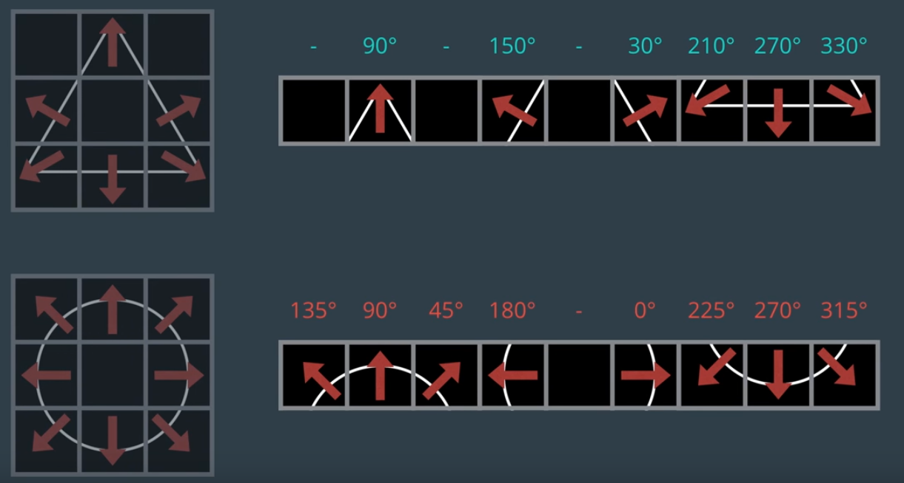
 

 
Ideally, the signature for a shape has enough flexibility to accommodate small variations in orientation, size, etc in contrast using gradient values directly. 

### Histogram of Oriented Gradient (HOG) Features

Assume, I have a 64 by 64 pixel image of a car  and I computed the gradient magnitudes and directions at each pixel. Now, instead of using all the gradient individual values, I grouped them up into small cells( like below size 8 by 8 pixels)

 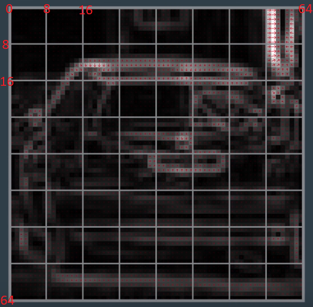
 

 
 Then I computed a histogram of gradient directions from each of the 64 pixels within the cell. The resulting histogram looks somewhat like below.

 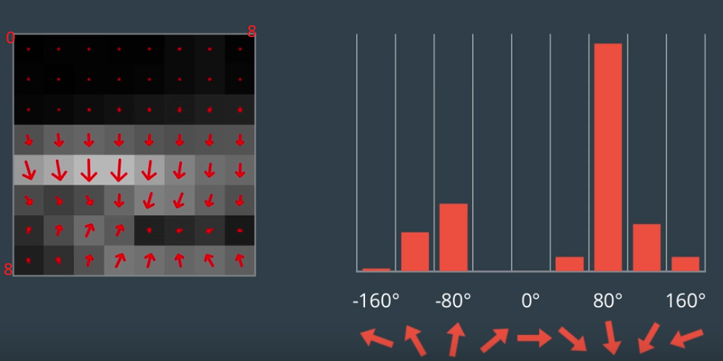
 

 
 A better way to visualize the histogram for an individual cell would be to add up the contributions in each orientation bin to get a sort of star with arms of different lengths like below
 
 

 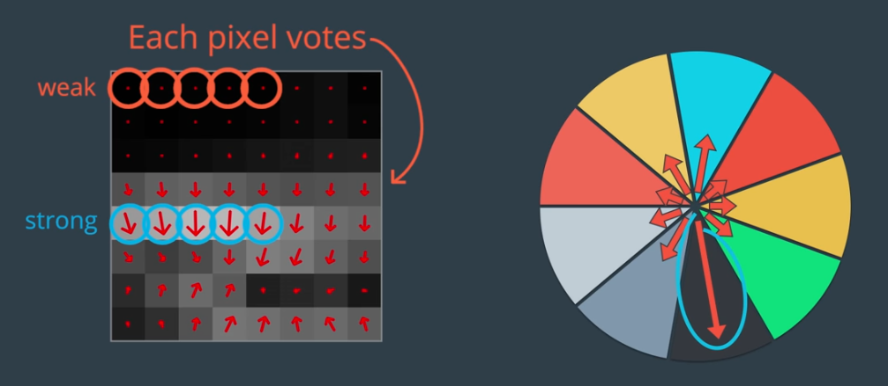
 

 
The direction with the longest arm is the dominant gradient direction in the cell. Note that the histogram is not strictly a count of the number of samples in each direction. Instead, I sum up the gradient magnitude of each sample. So stronger gradients contribute more weight to their orientation bin and the effect of small random gradients due to noise, etc., is reduced. In other words, each pixel in the image gets a vote on which histogram bin it belongs in based on the gradient direction at that position but the strength or weight of that vote depends on the gradient magnitude at that pixel. 

When I do voting for all the cells (64 cells), I begin to see a representation of the original structure emerge. As demonstrated with simpler shapes before something like below can be used as a signature for a given shape. 

 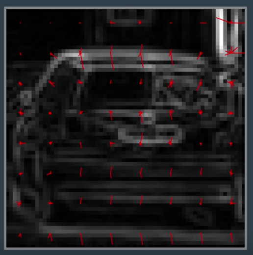
 

 
This is known as a histogram of oriented gradients, or HoG feature. The main advantage now is that I have built in the ability to accept small variations in the shape, while keeping the signature distinct enough. 

How accommodating or sensitive the feature is can be tweaked by 
* orientation bins
* grid of cells
* cell sizes
* adding any overlap between cells
* including normalizing for  intensity across small blocks of cells

You can find the original developer of HOG for object detection on the subject [here](http://lear.inrialpes.fr/people/triggs/pubs/Dalal-cvpr05.pdf).

 
### scikit-image HOG Exercise

In [this exercise](https://github.com/A2Amir/Object-Detection/blob/master/code/HistogramofOrientedGradient(HOG)Exercise.ipynb) I am going to use the scikit-image hog() function, which  takes in a single color channel or grayscaled image as input, as well as various parameters and computes HOG features for the image

The documentation for this function can be found [here](http://scikit-image.org/docs/dev/api/skimage.feature.html?highlight=feature%20hog#skimage.feature.hog) and a brief explanation of the algorithm and tutorial can be found [here](http://scikit-image.org/docs/dev/auto_examples/features_detection/plot_hog.html).

# 9. Data Exploration

 Throughout the rest of this lesson, I ll use [a relatively small labeled dataset](https://github.com/A2Amir/Object-Detection/tree/master/dataset) to try out feature extraction and training a classifier. Before I get on to training a classifier, let's explore the dataset a bit. This dataset is a subset of the data I'll be starting with for the project.

 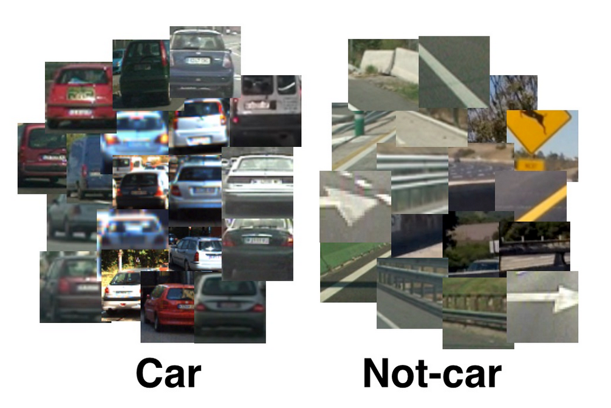
 

 
 
 #### Note:
 
 * you can download this subset of images for [vehicles](https://s3.amazonaws.com/udacity-sdc/Vehicle_Tracking/vehicles_smallset.zip) and [non-vehicles](https://s3.amazonaws.com/udacity-sdc/Vehicle_Tracking/non-vehicles_smallset.zip), or if you prefer you can directly grab the larger project dataset for [vehicles](https://s3.amazonaws.com/udacity-sdc/Vehicle_Tracking/vehicles.zip) and [non-vehicles](https://s3.amazonaws.com/udacity-sdc/Vehicle_Tracking/non-vehicles.zip).

* You can also download and explore the recently released Udacity labeled dataset. Each of [the Udacity datasets](https://github.com/udacity/self-driving-car/tree/master/annotations) comes with a labels.csv file that gives bounding box corners for each object labeled.

Here you can see [the code exercise](https://github.com/A2Amir/Object-Detection/blob/master/code/DataExplorationExercise.ipynb) I provided to extract the car/not-car image filenames into two lists. 

# 10. Combine and Normalize Features 

As noted before, it's not necessary to use only one kind of feature for object detection. 
I can combine both color-based and shape-based features. After all, they complement each other in the information they capture about a desired object to design a more robust detection system. 

However, I do need to be careful about how I use them. For example, assume that I am using HSV values as one input feature with the flatten vector containing a elements and HoG as the other feature with b elements. The simplest way of combining them is to concatenate the two (see gif).
 

 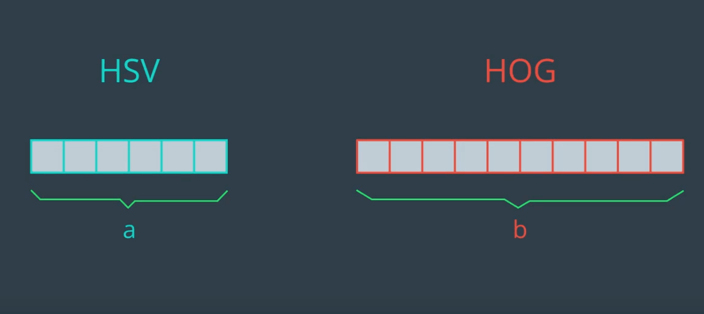

If I visualize the feature vector as a simple bar plot, I might notice a difference in magnitude between the color-based and gradient-based features. This is because they represent different quantities. A normalization step may prevent one type from dominating the other in later stages. 

 

 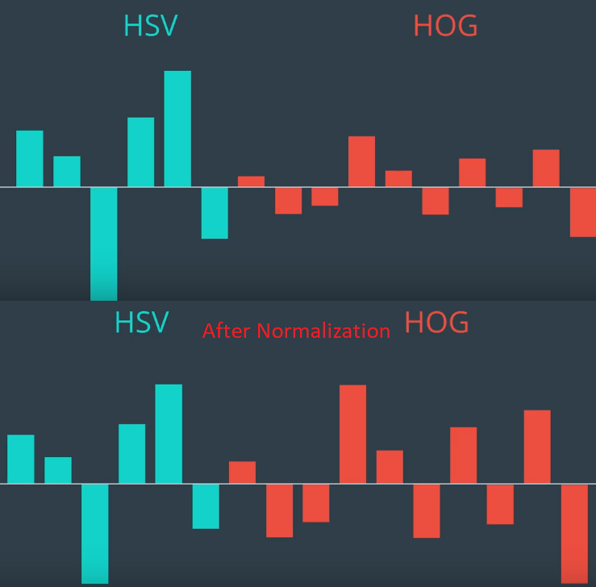
 

 

There might be a lot more elements of one type than the other. This may or may not be a problem in itself, but it's generally a good idea to see if there are any redundancies in the combined feature vector. For instance, I could use a decision tree to analyze the relative importance of features and drop the ones that are not contributing much. 

### Combine and Normalize Features Exercise

I've got several feature extraction methods in my toolkit and I am almost ready to train a classifier, but first, as in any machine learning application, I need to normalize my data. Python's sklearn package provides you with the StandardScaler method to accomplish this task. To read more about how I can extract features, choose different normalizations and combine them, check out [the exercise](https://github.com/A2Amir/Object-Detection/blob/master/code/CombineAndNormalizeFeaturesExercise.ipynb).

# 11. Build a Classifier

 I've learned how to extract suitable features from an image but how I can use them to detect cars. A classic approach is to first design a classifier that can differentiate car images from non-car images and then run that classifier across an entire frame sampling small patches along the way. The patches that classified as car are the desired detections(see gif below). 

 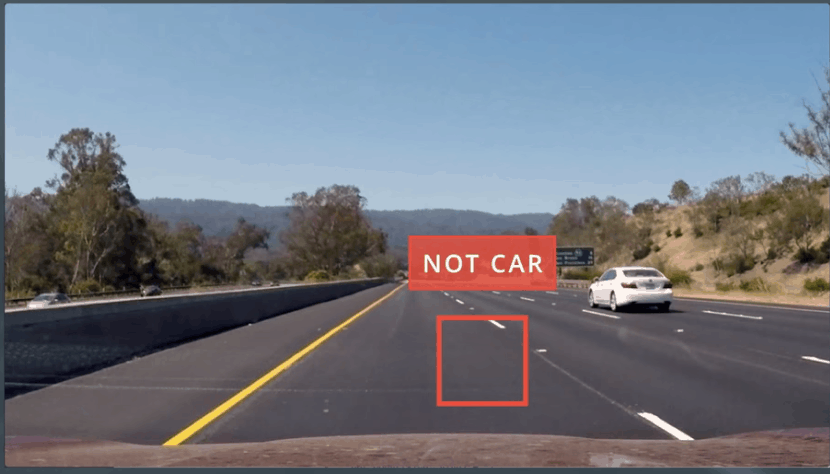

For this approach to work properly, I must train my classifier to distinguish car and non-car images but before training my classifier it is worth to mention that [my dataset](https://github.com/A2Amir/Object-Detection/tree/master/dataset) is a labelled (car and non car) and balanced(the Quantity of each class is Almost equal) dataset. if your dataset is a imbalanced dataset there are some techniques for handling imbalanced data sets, for example Data Augmentation.

For training my classifier I need to split my dataset into two collections:

* A training set 
* A test set. 

I will only use images from the training set when training my classifier and then check how it performs on unseen examples from the test set. 
Note:

 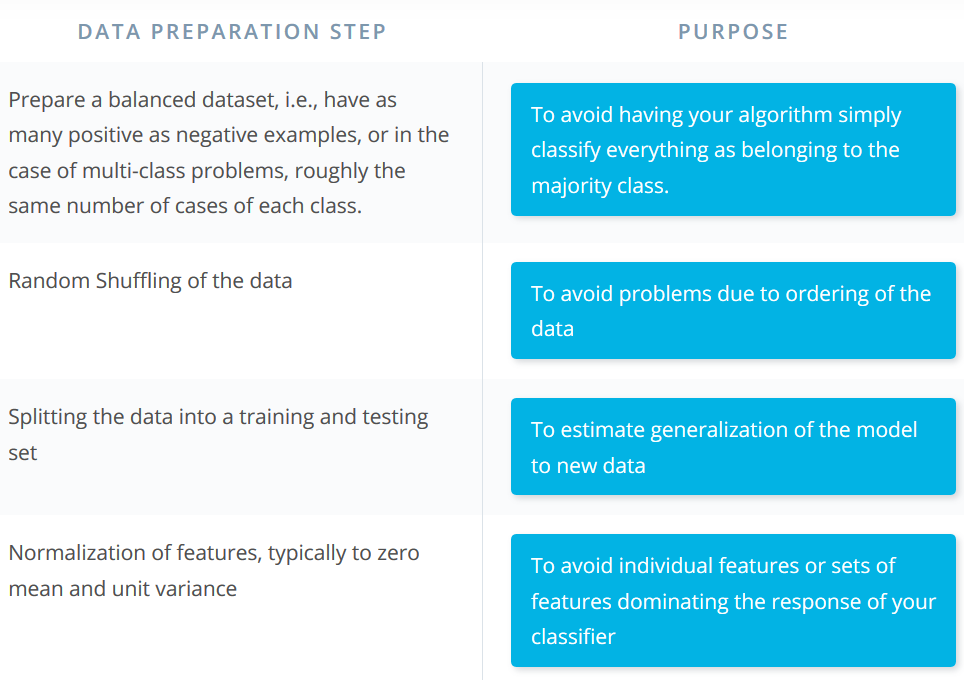
 

 
#### Training Phase

Below is presented a gif which shows the phase of training a classifier. The training phase is an iterative procedure where one or more samples are presented to the classifier at a time, which then predicts their labels. The error between these predicted labels and ground-truth is used as a signal to modify the parameters of a classifier. When the error falls below a certain threshold (see next image image), or when enough iterations.

 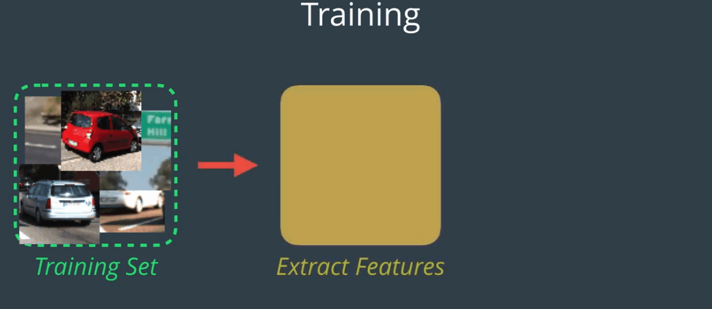

After training I can verify how it performs on previously unseen examples using the test set. The error on the test set is typically larger than that on the training set, which is expected. But If I keep training beyond a certain point (A), my training error may keep decreasing, but my test error will begin to increase again. This is known as overfitting. My model fits the training data very well, but is unable to generalize to unseen examples (See image below). 

 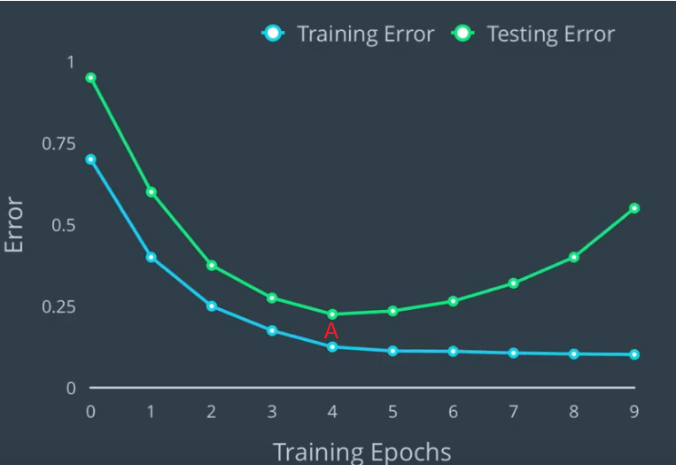
 

 
In the next exercise I am going to  implement a support vector machines as a classifier to classify car and none car objects based on the bin_spatial and color histogram features.

 #### Color Classify Exercise

In this [exercise](https://github.com/A2Amir/Object-Detection/blob/master/code/ColorClassifyExercise.ipynb) first I'll use the functions I defined in previous exercises, namely, bin_spatial(), color_hist(), and extract_features() then read in my car and non-car images and extract the color features for each. All that remains is to define a labels vector, shuffle and split the data into training and testing sets, scale the feature vectors to zero mean and unit variance, and finally, define a classifier and train it!

 ####  HOG Classify Exercise
In this [exercise](https://github.com/A2Amir/Object-Detection/blob/master/code/HOGClassifyExercise.ipynb), I am going to classify HOG features and see how well I can do.

# 12. Parameter Tuning

In the Color Classify and HOG Classify Exercises, I want to tune my  SVC algorithm which involves searching for a kernel, a gamma value and a C value that minimize prediction error. To tune my SVM vehicle detection model, I can use one of scikit-learn's parameter tuning algorithms.

When tuning SVM, remember that I can only tune the C parameter with a linear kernel. For a non-linear kernel, I can tune C and gamma.
Parameter Tuning in Scikit-learn. Scikit-learn includes two algorithms for carrying out an automatic parameter search:

* [GridSearchCV](http://scikit-learn.org/stable/modules/generated/sklearn.model_selection.GridSearchCV.html#sklearn.model_selection.GridSearchCV)

* [RandomizedSearchCV](http://scikit-learn.org/stable/modules/generated/sklearn.model_selection.RandomizedSearchCV.html#sklearn.model_selection.RandomizedSearchCV)

GridSearchCV exhaustively works through multiple parameter combinations, cross-validating as it goes. The beauty is that it can work through many combinations in only a couple extra lines of code.  For example, if I input the values C:[0.1, 1, 10] and gamma:[0.1, 1, 10], gridSearchCV will train and cross-validate every possible combination of (C, gamma): (0.1, 0.1), (0.1, 1), (0.1, 10), (1, .1), (1, 1), etc. 

RandomizedSearchCV works similarly to GridSearchCV except RandomizedSearchCV takes a random sample of parameter combinations. RandomizedSearchCV is faster than GridSearchCV since RandomizedSearchCV uses a subset of the parameter combinations.
To get familiar with Cross-validation and GridSearchCV check this Exercise.

# 13. Sliding Windows

The  next step is to implement a sliding window technique, where I'll step across an image in a grid pattern and extract the same features I trained my classifier on in each window. I'll run your classifier to give a prediction at each step and with any luck, it will tell me which windows in my image contains cars (see gif below).

 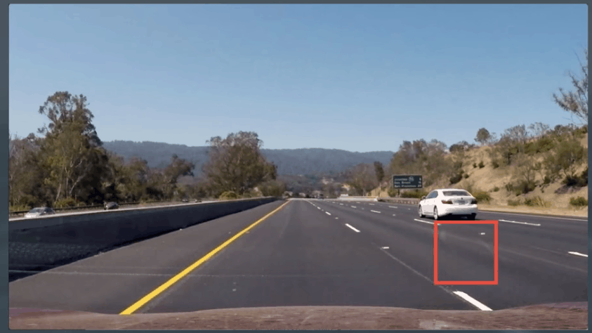
 

 
Before implementing a sliding window search, I need to decide what size window I want to search, where in the image I want to start and stop my search, and how much I want windows to overlap. Suppose I have an image that is 256 x 256 pixels and I want to search windows of a size 128 x 128 pixels each with an overlap of 50% between adjacent windows in both the vertical and horizontal dimensions. My sliding window search would then look like below:

 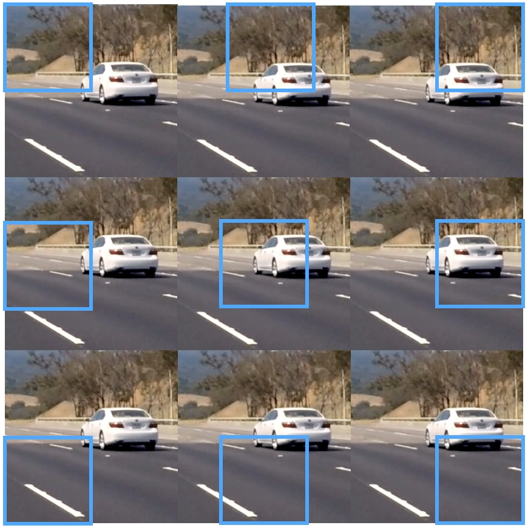
 

 As seen, I searched 9 windows total in this case.

#### To calculate the total_windows  I can use the general Formula below:

     •	windows_x = 1 + (image_width - window_width)/(window_width * overlap_proportion)
     •	windows_y = 1 + (image_height - window_height)/(window_height * overlap_proportion)
     •	total_windows = windows_x * windows_y 
     
#### Sliding Window Exercise
In this [exercise](https://github.com/A2Amir/Object-Detection/blob/master/code/SlidingWindowExercise.ipynb), I am going to write a function that takes in an image, start and stop positions in both x and y , window size (x and y dimensions), and overlap fraction (also for both x and y)und draw all bounding boxes for the search windows on image. 

 
# 14 Search and Classify
Now I am able to run a sliding window search on an image and I've trained a classifier... time to 
run my sliding window search, extract features, and predict whether each window contains a car or not. 

#### Search and Classify Exercise
In this [exercise](https://github.com/A2Amir/Object-Detection/blob/master/code/SearchAndClassifyExercise.ipynb), I will use all functions I've defined so far in the lesson plus two new functions ( single_img_features() and search_windows() ). I can use these to search over all the windows defined by my slide_windows(), extract features at each window position, and predict with my classifier on each set of features. 

# 15. Multi-scale Windows
As seen in the Search and Classify Exercise my trained support vector classifier could not detect all vehicles in the image very well (see result below)  

 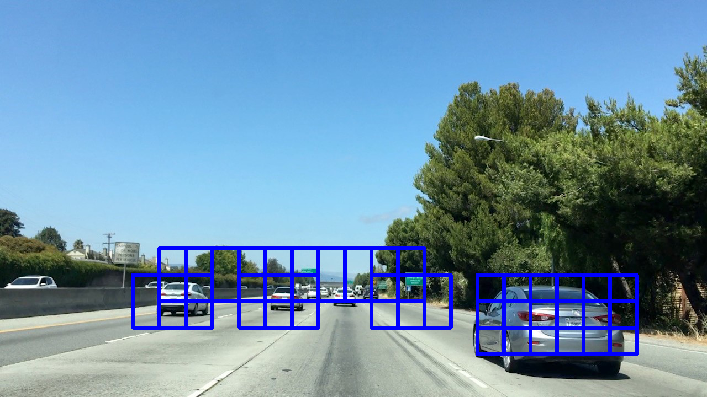
 

 
 In general, I do not know what size my object of interest will be in the image I am searching. So makes sense to search in multiple scales. In this case, it's good idea to establish a minimum and a maximum scale at which I expect the object to appear and then reasonable number of intermediate scales to scan as well(see image below). 
 
 

 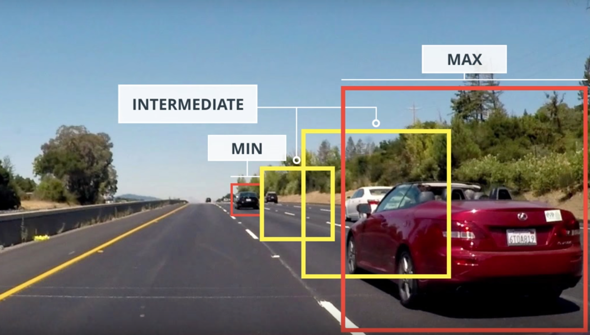
 

 
The think to be careful about scaling is that the total number of windows I am searching can increase rapidly which means my algorithm will run slower. It makes sense to restrict my search to the only areas of the images where vehicles might appear.
 
Furthermore, when it comes to scale, I know for example that vehicles that appear small will be near the horizon. So search in a small scales could be restricted to even narrow a strip across the image.

### Hog Sub-sampling Window Search Exercise
To search in multiple scales I am going to write in this [exercise](https://github.com/A2Amir/Object-Detection/blob/master/code/HogSub-samplingWindowSearchExercise.ipynb) a more efficient method which allows me extracting the Hog features once for each of a small set of predetermined window sizes (defined by a scale argument) and then can be sub-sampled to get all of its overlaying windows. Each window is defined by a scaling factor that impacts the window size. The scale factor can be set on different regions of the image (e.g. small near the horizon, larger in the center).

 # 16. False Positives
 

Now I have a scheme for searching across the image for possible detections, but I noticed that my classifier is not perfect. In some cases, it will report multiple overlapping instances of the same car (known as duplicates detections) or even report cars where there are none (known as false positives).I will need to filter them out.

 

 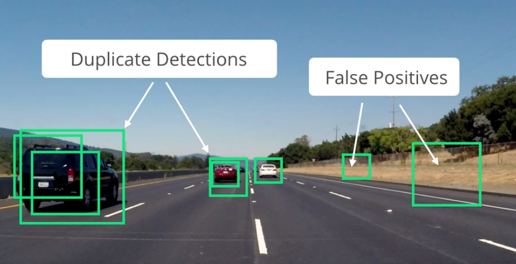
 

 
I am performing the task of identifying where vehicles are on the road but equally important where they are not. I would like to get the best estimate possible for the position and size of the cars I detect. That means whether it's a single detection or multiple detections on the same car, a tight bounding box for each car is what I am aiming for. In this next exercise, I'll write code to handle multiple detections and  false positives.

#### Multiple Detections & False Positives Exerciese

Below are presented six consecutive frames from the project video and I'm showing all the bounding boxes for where my classifier reported positive detections. I can see that overlapping detections exist for each of the two vehicles and in two of the frames, I find a false positive detection on the guardrail to the left. In this [exercise](https://github.com/A2Amir/Traditional-Object-Detection/blob/master/code/MultipleDetectionsAndFalsePositivesExerciese.ipynb), I'll build a heat-map from these detections in order to combine overlapping detections and remove false positives.

# 17. Summarize my tracking pipeline

In each frame of the video, I will run a search for vehicles using a sliding window and Hog Sub-sampling Window techniques Wherever my classifier returns a positive detection,I'll record the position of the window in which the detection was made (check [exercise](https://github.com/A2Amir/Traditional-Object-Detection/blob/master/code/Pipline.ipynb)).

In some cases I might detect the same vehicle in overlapping windows or at different scales. In the case of overlapping detections I can assign the position of the detection to the centroid of the overlapping windows. I also have false positives which I can filter out by determining which detections appear in one frame but not the next. 

Once I have a high confidence detection I can record how it's centroid is moving from frame to frame and I eventually estimate where it will appear in each subsequent frame.

# 18. Deep Learning Approach

As seen in the traditional aprroach for object detection we have many parameters to tune which could be a big proplem to use this approach in the self driving car system. In the [next lesson](https://github.com/A2Amir/Traditional-Object-Detection) I am going to use deep learning approach as a proper detection system for vehicles in the self driving cars.
 
