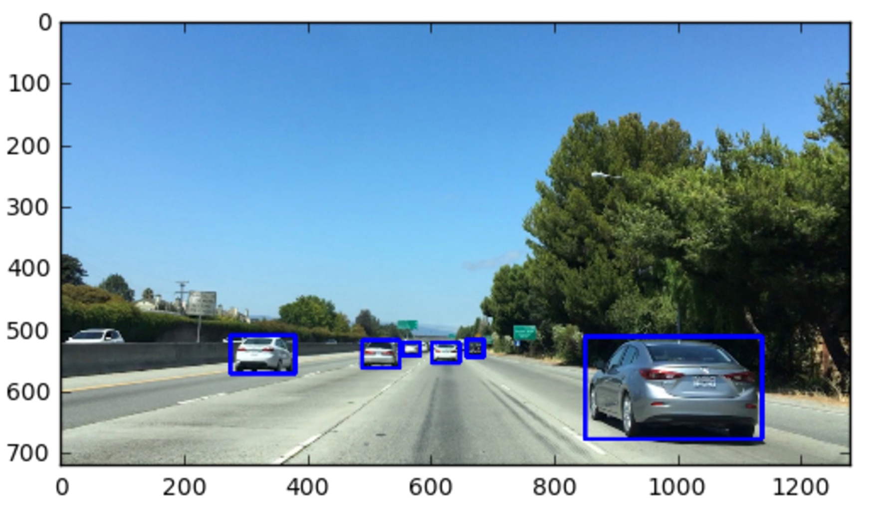

# 1. Introduction

Image classification is tricky and it becomes even trickier when I don't know exactly where in an image my objects of interest will appear or  what size they'll be or even how many of them I might find. 

In this lesion I will focus on the task of detecting vehicles in images taken from a camera mounted on the front of a car but the same principles apply to pedestrian detection, or traffic sign detection, or identifying any object I might be looking for in an image. 

Object detection and tracking is a central theme in computer vision and in this lesson I will be using what you might call traditional computer vision techniques to tackle this problem. 

I will first explore what kind of visual features I can extract from images in order to reliably classify vehicles. Next, I will look into searching an image for detections and then I will track those detections from frame to frame in a video stream. In the end of this lesson, I am going to implement a pipeline to detect and track vehicles in a video stream.

# 2. Manual Vehicle Detection

 
 

