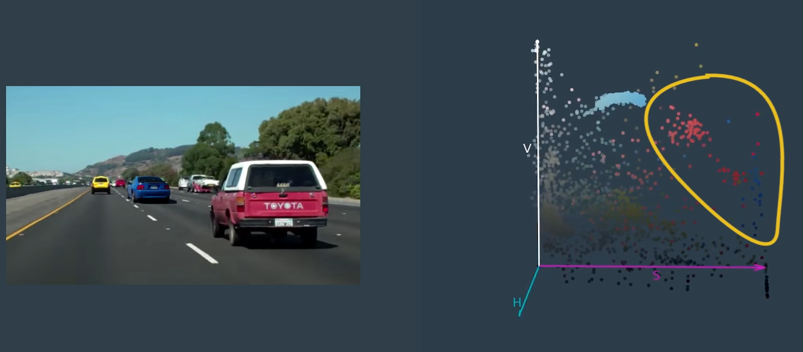

# 1. Introduction

Image classification is tricky and it becomes even trickier when I don't know exactly where in an image my objects of interest will appear or  what size they'll be or even how many of them I might find. 

In this lesion I will focus on the task of detecting vehicles in images taken from a camera mounted on the front of a car but the same principles apply to pedestrian detection, or traffic sign detection, or identifying any object I might be looking for in an image. 

Object detection and tracking is a central theme in computer vision and in this lesson I will be using what you might call traditional computer vision techniques to tackle this problem. 

I will first explore what kind of visual features I can extract from images in order to reliably classify vehicles. Next, I will look into searching an image for detections and then I will track those detections from frame to frame in a video stream. In the end of this lesson, I am going to implement a pipeline to detect and track vehicles in a video stream.

# 2. Manual Vehicle Detection

 
 

 
Assume, I will have an algorithm that's outputting bounding box positions and I'll want an easy way to plot them up over my images (like above). So, now is a good time to get familiar with the cv2.rectangle() function that makes it easy to draw boxes of different size, shape and color.

    cv2.rectangle(image_to_draw_on, (x1, y1), (x2, y2), color, thick)
 
In this call to cv2.rectangle() my image_to_draw_on should be the copy of your image, then (x1, y1) and (x2, y2) are the x and y coordinates of any two opposing corners of the bounding box I want to draw. color is a 3-tuple, for example, (0, 0, 255) for blue, and thick is an optional integer parameter to define the box thickness.

If you want to investigate this function more closely, take a look at the bounding boxes exercise [code](https://github.com/A2Amir/Object-Detection/blob/master/code/BoundingBoxesExercise.ipynb)

# 3. Features

Color, Apparent size, shape , position within image  are useful characteristics for identifying cars in an  image. All of these potential characteristics are features that I can use.  Features describe the characteristics of an object and with images, it really all comes down to intensity and gradients of intensity, and how these features capture the color and shape of an object.

Different features (like intensity and gradients of intensity) capture  the characteristic(s) about an object in an image. For example by **raw pixel intensity** (I mean essentially taking the image itself as features) give us color and shape information or **Histogram of pixel intensity** (With a histogram, I've discarded spatial information) give us only color information or **Gradients of pixel intensity** give us information about shaps only.

What features are more important may depend upon the appearance of  the objects in question. In most applications, I'll end up using a combination of features that give me the best results. 

 
 

 
 # 4. Color Features and Template matching
 
 The simplest feature I can get from images consists of raw color values. For instance, below is an image of a car. Let's say I want to find out whether some region (yellow box) of a new test image contains a car or not.  Well, using my known car image as is (red car), I can simply find the image difference between the car image and the test region (yellow box), and see the difference is small. 
This basically means subtracting the corresponding color values, aggregating the differences and comparing it with the threshold. 

 
 

 
Note: alternatively, I could compute the correlation between the car image and test region and check if that is high.

This general approach is known as template matching. My known image is the template and I try to match it with regions of the test image. Template matching does work in limited circumstances but isn't very helpful for my case. 

To figure out when template matching works and when it doesn't, I am going to play around with the OpenCV cv2.matchTemplate() function! In [the bounding boxes exercise](https://github.com/A2Amir/Object-Detection/blob/master/code/BoundingBoxesExercise.ipynb), I found six cars in the image above. This time, I am going to play the opposite game. Assuming I know these six cars are what I am looking for, I can use them as templates and search the image for matches.

 
 

 
As seen in [the Template Matching code](https://github.com/A2Amir/Object-Detection/blob/master/code/TemplateMatchingExercise.ipynb) with template matching we can only find very close matches, and changes in size or orientation of a car make it impossible to match with a template.

# 5. Color Histogram Features
Template matching is useful for detecting things that do not vary in their appearance much. For instance, icons or emojis on the screen. But for most real world objects that appear in different forms, orientation, sizes, this technique doesn't work quite well because it depends on raw color values laid out in a specific order.

To solve this problem I need to find some transformations that are robust to changes in appearance. a transform is to compute the histogram of color values in an image and compare the histogram of a known object with regions of a test

 
 

 
#### Color Histograms Exercise 
In this exercise I'll use one template used from the last exercise as an example and look at histograms of pixel intensity (color histograms) as features by using

     np.histogram()

Check this [code](https://github.com/A2Amir/Object-Detection/blob/master/code/ColorHistogramsExercise%20.ipynb) to get more information.

#### Histogram Comparison

Let's look at the color histogram features for two totally different images. The first image is of a red car and the second a blue car. The red car's color histograms are displayed on the first row and the blue car's are displayed on the second row below. Here I am just looking at 8 bins per RGB channel.

I could differentiate the two images based on the differences in histograms alone. As expected the image of the red car has a greater intensity of total bin values in the R Histogram 1 (Red Channel) compared to the blue car's R Histogram 2. In contrast the blue car has a greater intensity of total bin values in B Histogram 2 (Blue Channel) than the red car's B Histogram 1 features. Differentiating images by the intensity and range of color they contain can be helpful for looking at car vs non-car images.

 
 

# 5. Color Spaces

Whether I use raw colors directly or build a histogram of those values, I still haven't solved the problem of representing objects of the same class that can be of different colors. Let's take a look at the image below to see how its color values are distributed in the RGB color space.

 
 

 
In the above example, the red and blue cars' pixels are clustered into two separate groups. Although I could come up with a scheme to identify these groups using RGB values but it can get complicated very quickly as I try to accommodate different colors. 

In the [lane finding lesson](https://github.com/A2Amir/Advanced-Lane-Line-Finding), I explored other color spaces like HLS and LUV to see where alternated representations of color space could make the object I am looking for stand out against the background. Instead of the raw red, green, blue values I get from a camera I look at saturation values (HSV color space) which seem the car pixels for the image above cluster  well on the saturation value plane.

 
 

 
But this(well clustering) may not be true for other images. In the next exercise I look at how the pixel values are distributed in a different color space and then I want to check if car pixels stand out from non-car pixels.

#### Explore Color Spaces Ecercise

Here is [a code](https://github.com/A2Amir/Object-Detection/blob/master/code/ExploreColorSpacesExercise.ipynb) snippet that can be used to generate 3D plots of the distribution of color values in an image by plotting each pixel in some color space.

As seen in the exercise by trying different color spaces such as LUV or HLS I can find a way to consistently separate vehicle images from non-vehicles but It doesn't have to be perfect, but it will help when combined with other kinds of features fed into a classifier.

# 6. Spatial Binning of Color
raw pixel values are still quite useful to include in my feature vector in searching for cars. While it could be cumbersome to include three color channels of a full resolution image, I can perform spatial binning on an image and still retain enough information to help in finding vehicles.

As seen in the example below, even going all the way down to 32 x 32 pixel resolution, the car itself is still clearly identifiable by eye, and this means that the relevant features are still preserved at this resolution.

 
 

 
A convenient function for scaling down the resolution of an image is OpenCV's cv2.resize(). I can use it to scale a color image or a single color channel like this:
~~~python
import cv2
import matplotlib.image as mpimg

image = mpimg.imread('test_img.jpg')
small_img = cv2.resize(image, (32, 32))
print(small_img.shape)
(32, 32, 3)
~~~
then I can  convert the small image to a one dimensional feature vector, I could simply say something like:
~~~python
feature_vec = small_img.ravel()
print(feature_vec.shape)
(3072,)
~~~

#### Spatial Binning Exercise
the goal of [this exercise](https://github.com/A2Amir/Object-Detection/blob/master/code/SpatialBinningExercise.ipynb) is to write a function that takes an image, a color space conversion, and the resolution I would like to convert it to, and returns a feature vector.

# 7. Gradient Features

Transforming color values give me only one aspect of an object's appearance. When I have a class of objects that can vary in color (see below), structural ques like gradients or edges might give me a more robust presentation. 

 
 

 
 One problem with using gradient values directly is that it makes the signature too sensitive.  In fact, the presence of gradients in specific directions around the center may actually capture some more notion of shape. Let's take a look at some simple shapes to better understand this idea.
Below is  a gradient image(in specific directions around the center) of a triangle If I chop up the gradients into different grid cells and treat the cells as a flat (1D array) I obtain a signature for the triangle. Similarly to a circle.

 
 

 
Ideally, the signature for a shape has enough flexibility to accommodate small variations in orientation, size, etc in contrast using gradient values directly. 

### Histogram of Oriented Gradient (HOG) Features

Assume, I have a 64 by 64 pixel image of a car  and I computed the gradient magnitudes and directions at each pixel. Now, instead of using all the gradient individual values, I grouped them up into small cells( like below size 8 by 8 pixels)

 
 

 
 Then I computed a histogram of gradient directions from each of the 64 pixels within the cell. The resulting histogram looks somewhat like below.

 
 

 
 A better way to visualize the histogram for an individual cell would be to add up the contributions in each orientation bin to get a sort of star with arms of different lengths like below
 
 

 
 

 
The direction with the longest arm is the dominant gradient direction in the cell. Note that the histogram is not strictly a count of the number of samples in each direction. Instead, I sum up the gradient magnitude of each sample. So stronger gradients contribute more weight to their orientation bin and the effect of small random gradients due to noise, etc., is reduced. In other words, each pixel in the image gets a vote on which histogram bin it belongs in based on the gradient direction at that position but the strength or weight of that vote depends on the gradient magnitude at that pixel. 

When I do voting for all the cells (64 cells), I begin to see a representation of the original structure emerge. As demonstrated with simpler shapes before something like below can be used as a signature for a given shape. 

 
 

 
This is known as a histogram of oriented gradients, or HoG feature. The main advantage now is that I have built in the ability to accept small variations in the shape, while keeping the signature distinct enough. 

How accommodating or sensitive the feature is can be tweaked by 
* orientation bins
* grid of cells
* cell sizes
* adding any overlap between cells
* including normalizing for  intensity across small blocks of cells

You can find the original developer of HOG for object detection on the subject [here](http://lear.inrialpes.fr/people/triggs/pubs/Dalal-cvpr05.pdf).

 
 
 
